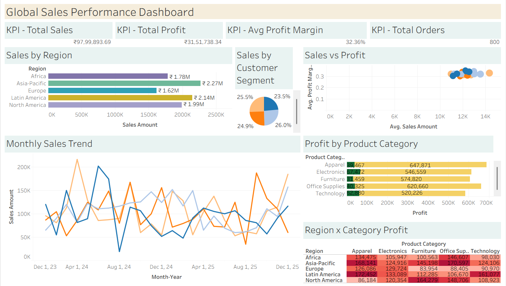

# 📊 Global Sales Performance & Profitability Dashboard

> An end-to-end Tableau business intelligence project analyzing **₹97.99L+ in global sales** across 5 regions, 5 product categories, 4 customer segments, and 800 transactions (2024–2025).

---

## 🎯 Objective

To design an interactive Tableau dashboard that empowers sales leadership and business analysts to:
- Monitor global sales performance and profitability in real time
- Identify high-performing regions, product categories, and customer segments
- Detect seasonal trends and quarterly patterns to inform forecasting
- Evaluate delivery performance and channel efficiency

---

## 🛠️ Tools & Technologies

| Tool | Purpose |
|------|---------|
| **Tableau Desktop/Public** | Dashboard design & visualization |
| **Microsoft Excel / CSV** | Data storage & preprocessing |
| **GitHub** | Version control & portfolio hosting |

---

## 📁 Repository Structure

```
global-sales-dashboard/
│
├── 📂 data/
│   └── global_sales_dataset.csv        # 800-row AI-generated dataset
│
├── 📂 dashboard/
│   ├── Global Sales Performance & Profitability.twbx     # Packaged Tableau workbook
│
├── 📂 screenshots/
│   ├── Chart 1.png
│   ├── Chart 2.png
│   ├── Chart 3.png
│   ├── Chart 4.png
│   └── Chart 5.png
│   └── Chart 6.png
│   └── Chart 7.png
│   └── Dashboard.png
│
└── README.md
```

---

## 📂 Dataset Description

**File:** `global_sales_dataset.csv`  
**Rows:** 800 | **Columns:** 20 | **Period:** January 2024 – December 2025

| Column | Description |
|--------|-------------|
| Order ID | Unique transaction identifier |
| Order Date | Date of purchase |
| Month / Quarter / Year | Time hierarchy for trend analysis |
| Region | 5 global regions (Africa, Asia-Pacific, Europe, Latin America, North America) |
| Country / City | Geographic granularity |
| Customer Segment | Corporate, Small Business, Enterprise, Consumer |
| Product Category | Apparel, Electronics, Furniture, Office Supplies, Technology |
| Product Name | 15+ individual products |
| Sales Channel | Online, Retail Store, Distributor, Direct Sales |
| Sales Amount / Cost / Profit | Core financial metrics |
| Profit Margin % | Calculated profitability ratio |
| Quantity Sold | Units per order |
| Discount % | Applied discount rate |
| Shipping Cost | Logistics cost per order |
| Delivery Status | Delivered, In Transit, Delayed, Returned |

---

## 📊 Dashboard Features

### KPI Cards (Top Row)
- **Total Sales:** ₹97,99,893.69
- **Total Profit:** ₹31,51,738.34
- **Avg Profit Margin:** 32.36%
- **Total Orders:** 800

### Visualizations
| Chart | Insight |
|-------|---------|
| 🌍 Sales by Region (Bar Chart) | Asia-Pacific leads with ₹22.69L |
| 📈 Monthly Sales Trend (Line Chart) | Multi-region seasonality patterns |
| 🥧 Sales by Customer Segment (Donut) | Nearly equal split (~25% each) |
| 💹 Sales vs Profit (Scatter Plot) | Cluster analysis of high-value orders |
| 📦 Profit by Product Category (Bar) | Apparel tops with ₹6.87L profit |
| 🔥 Region × Category Heatmap | Latin America × Apparel: highest at ₹1.72L |

---

## 🔍 Key Business Insights

1. **Asia-Pacific is the top revenue region** (₹22.69L, ~23.2% of total sales), followed closely by Latin America (₹21.45L).

2. **Apparel delivers the highest total profit** (₹6.87L), despite not being the top revenue category — indicating superior margin efficiency.

3. **Furniture has the highest average profit margin** (33.27%) of all categories, making it the most margin-rich segment.

4. **Online channel outperforms on profit margin** (33.35% avg), while Retail Store lags at 30.99% — suggesting room for optimizing in-store pricing.

5. **Latin America × Apparel is the single most profitable regional-category combination** (₹1.72L), an untapped growth signal.

6. **Discount % has near-zero correlation with profit margin** (r = 0.017), indicating discounts are not hurting profitability — possibly due to volume compensation.

7. **71.88% of orders are successfully delivered**; only 4% are returned — strong supply chain health. However, 8.88% are delayed, an area for operational improvement.

8. **2024 outperformed 2025** in both sales (₹51.43L vs ₹46.57L) and profit, suggesting a slight growth slowdown that warrants strategic attention.

9. **Africa's Office Supplies** (₹1.47L) and **Asia-Pacific's Office Supplies** (₹1.71L) are standout sub-markets with strong profitability.

10. **Smart Speaker** is the single highest-profit product (₹1.76L), pointing to strong consumer demand for tech accessories.

---

## 🧮 Calculated Fields Used in Tableau

```
Profit Margin % = SUM([Profit]) / SUM([Sales Amount])
Average Order Value = SUM([Sales Amount]) / COUNT([Order ID])
Discount Impact % = AVG([Discount %]) * SUM([Sales Amount])
Shipping Cost Ratio = SUM([Shipping Cost]) / SUM([Sales Amount])
```

---

## 📸 Dashboard Preview



---

## 🧠 Tableau Concepts Applied

- Dimensions & Measures
- Calculated Fields
- Aggregations (SUM, AVG, COUNT)
- Filters & Context Filters
- Dashboard Actions (Filter on Click)
- Color Encoding & Conditional Formatting
- Heatmaps with Diverging Color Scales
- Scatter Plots with Size Encoding

---


## 👤 Author

**Debarati Pal**  

